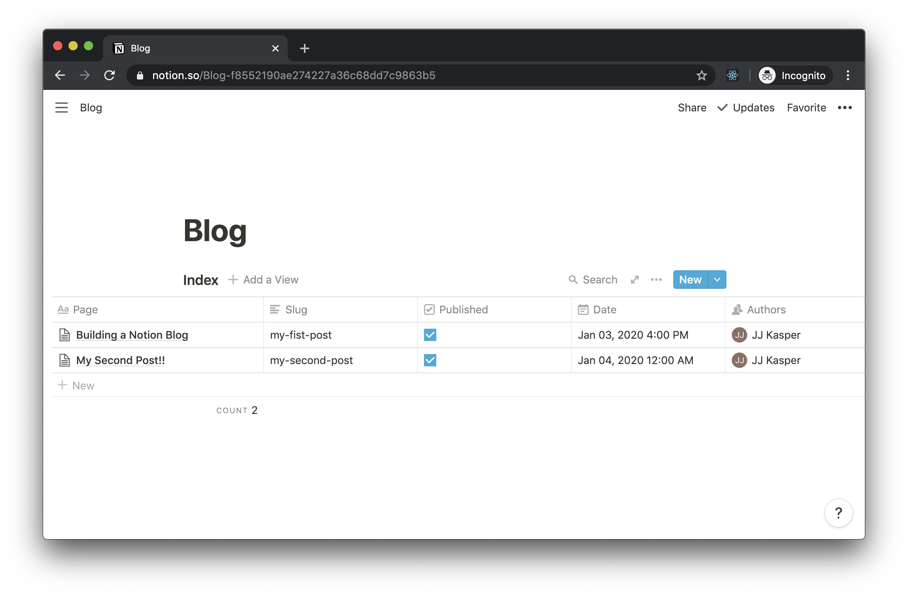

# Notion Blog

This is an example Next.js project that shows Next.js' upcoming SSG (static-site generation) support using Notion's **private** API for a backend.

**Note**: This example uses the experimental SSG hooks only available in the Next.js canary branch! The APIs used within this example will change over time. Since it is using a private API and experimental features, use at your own risk as these things could change at any moment.

**Live Example hosted on Vercel**: https://www.thomasmoawad.com

## Environment Variables

1. `NOTION_TOKEN` is the `v2_token` cookie
1. `BLOG_INDEX_ID` is found in the URL of your table

## Creating Your Pages Table

**Note**: this is auto run if a table isn't detected the first time visiting `/blog`

### Manually Creating the Table

1. Create a blank page in Notion
2. Create a **inline** table on that page, don't use a full page table as it requires querying differently
3. Add the below fields to the table

The table should have the following properties:

- `Page`: this the blog post's page
- `Slug`: this is the blog post's slug relative to `/blog`, it should be a text property
- `Published`: this filters blog posts in **production**, it should be a checkbox property
- `Date`: this is when the blog post appears as posted, it should be a date property
- `Authors`: this is a list of Notion users that wrote the post, it should be a person property

## Local Set up

1. `curl -o- https://raw.githubusercontent.com/nvm-sh/nvm/v0.40.3/install.sh | bash`
1. `nvm install 22`

## Run Locally

To run the project locally you need to follow steps 1 and 2 of [deploying](#deploy-your-own) and then follow the below steps

1. `nvm use 22`
1. Install dependencies `yarn`
1. Run next in development mode `yarn dev`
1. Access `http://localhost:3000/blog/generating-image-based-song-recommendations-with-google-gemini-and-spotify-apis`

## Prouction Build

1. Build and run in production mode `yarn build && yarn start`

## Credits

- Guillermo Rauch [@rauchg](https://twitter.com/rauchg) for the initial idea
- Shu Ding [@shuding\_](https://twitter.com/shuding_) for the design help
- Luis Alvarez [@luis_fades](https://twitter.com/luis_fades) for design help and bug catching

### Fix Deployment Error

Error: ijjk/notion-blog#97 Solution: NODE_OPTIONS=--openssl-legacy-provider
